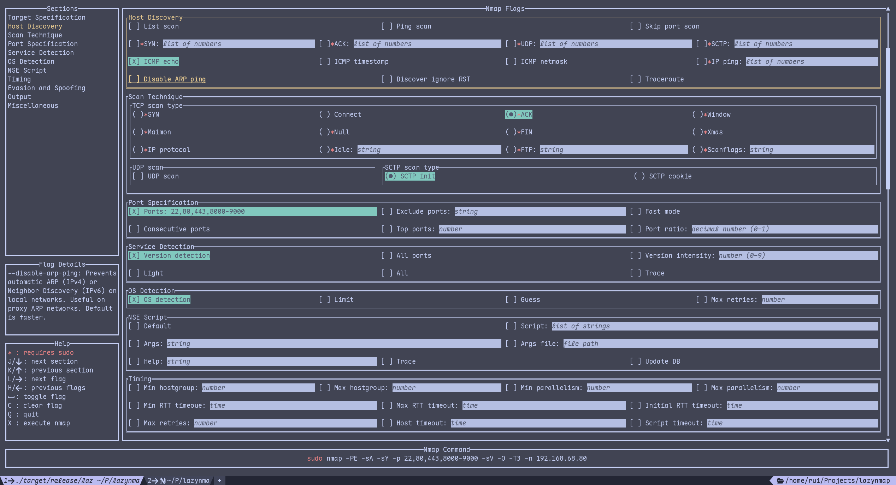

# ⚡ lazynmap ⚡

Tired of memorizing cryptic nmap flags? 😴 Say goodbye to the command-line struggle and hello to `lazynmap`! 🎉



`lazynmap` is a slick terminal user interface that transforms nmap command creation into a breeze. Craft the perfect scan command without ever leaving the comfort of its intuitive UI. 🚀

## 🔥 Features 🔥

- **Interactive UI:** Build nmap commands visually and interactively. No more endless man page scrolling! 📜
- **Comprehensive Options:** It's got all the nmap scan options covered:
  - 🎯 Target Specification
  - 🕵️ Host Discovery
  - 📡 Scan Techniques
  - 🚪 Port Specification
  - 🔬 Service Detection
  - 💻 OS Detection
  - ⏱️ Timing and Performance
  - 👻 Evasion and Spoofing
  - 📄 Output
  - ✨ Miscellaneous
  - 📜 NSE Scripts
- **Live Command Preview:** See the nmap command being built in real-time as you edit options. 🏗️
- **Direct Execution:** Execute the command directly from the app! `lazynmap` will even let you know if `sudo` privileges are needed. 🛡️
- **Input Validation:** `lazynmap` ensures that the values you enter are valid for each nmap flag, so you can avoid common mistakes. ✅
- **Keyboard Warrior Friendly:** Navigate the entire UI with your keyboard. ⌨️
  - **`j` / `Down`**: Next section
  - **`k` / `Up`**: Previous section
  - **`l` / `Right`**: Next flag
  - **`h` / `Left`**: Previous flag
  - **`Space`**: Toggle/Select option
  - **`Enter`**: Edit value
  - **`c`**: Clear/Reset value
  - **`x`**: Execute command
  - **`q`**: Quit

## 🛠️ Installation 🛠️

### Local Compilation

1.  Make sure you have Rust and Cargo installed on your system. 🦀
2.  Clone this repository: `git clone https://github.com/ruiiiijiiiiang/lazynmap.git`
3.  Navigate into the project directory: `cd lazynmap`
4.  Build the project for release: `cargo build --release`
5.  The executable will be waiting for you at `target/release/lazynmap`.

### Binary Release

You can download the pre-compiled binary for x86_64 Linux from the [releases page](https://github.com/ruiiiijiiiiang/lazynmap/releases).

### From crates.io

If you have Rust and Cargo installed, you can install `lazynmap` directly from [crates.io](https://crates.io/):

```bash
cargo install lazynmap
```

### Arch Linux (AUR)

For Arch Linux users, `lazynmap` is available on the AUR:

```bash
pacman -S lazynmap
```

### Nix Flake

If you have Nix installed with flakes enabled, you can run `lazynmap` directly:

```bash
nix run github:ruiiiijiiiiang/lazynmap
```

Or, you can install it to your system by adding it to your `flake.nix` inputs and packages.

## 🚀 Usage 🚀

Simply run the application from your terminal:

```bash
lazynmap
```

The awesome `lazynmap` terminal interface will fire up, ready for you to craft your nmap commands with ease!

## 🤝 Contributing 🤝

Contributions are welcome! If you have a feature request, bug report, or want to contribute to the code, please feel free to open an issue or submit a pull request on GitHub.

## 📜 License 📜

This project is licensed under the MIT License. See the [LICENSE](LICENSE) file for the full details.
